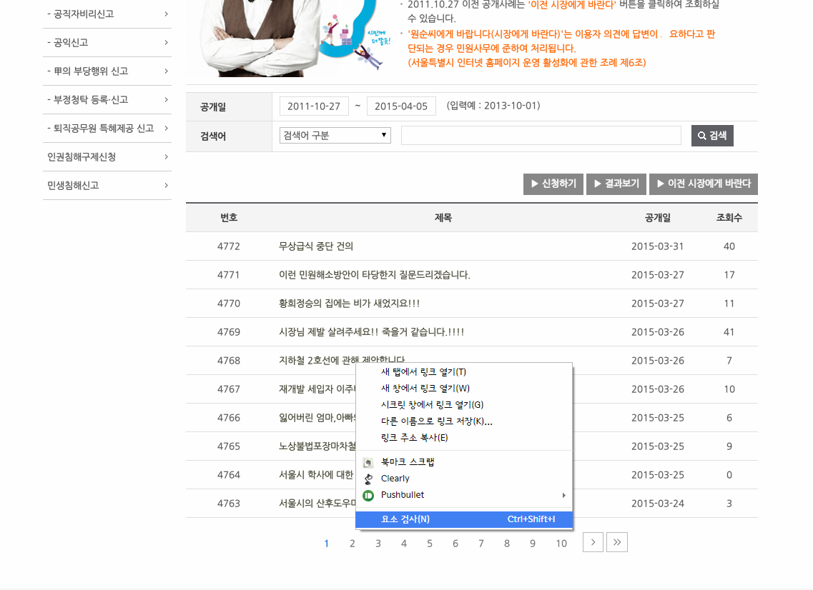

# R로 하는 기초 크롤링

데이터를 분석하고자 할 때 분석하려는 데이터가 파일 또는 DB의 형태로 존해하기도 하지만 인터넷 상에 올라가있는 자료를 가져와서 분석해야 하는 경우도 있다. 특히 API형태로 자료를 가져오지 못하는 경우에는 직접 자료를 긁어와야하는 경우가 생긴다.

[서울특별시 응답소](http://eungdapso.seoul.go.kr) 홈페이지에 들어가보자


응답소에 있는 ["원순씨에게 바랍니다"](http://eungdapso.seoul.go.kr/Community/WonSoon_List.jsp) 페이지에 들어가서 민원 제목 목록을 가져오도록 하자


----

## 라이브러리 설치

```{r, eval=FALSE}
install.packages("rCurl")
install.packages("XML")
```

두 개의 패키지를 먼저 설치한다

우분투의 경우 두 패키지가 설치가 안된다면

```
sudo apt-get install libcurl4-openssl-dev
sudo apt-get install libxml2-dev
```
각각을 설치하고 다시 `install.packages`를 시도해보자

설치가 완료되었다면 라이브러리를 불러서 제대로 로드되는지 확인

```{r}
library(XML)
library(RCurl)
```

----

## 자료 가져오기

이제 자료를 가져오기 위해서 해당 항목의 **xpath**를 알아보자

**크롬**을 기준으로 설명하지만 다른 브라우저들도 비슷한 기능이 있을것이다

우선 원하는 항목을 **우클릭**하고 **요소검사**를 실행하자



**Elements**창을 보면 선택항 항목에 해당하는 부분이 하이라이트 되는데 거기서 오른쪽클릭을 하고 `Copy XPath`를 누르자

> //*[@id="contents"]/form/table[2]/tbody/tr[7]/td[2]/a

XPath에 대한 설명은 [위키피디아](http://ko.wikipedia.org/wiki/XPath)로 대신하도록 한다

---

이제 위 Xpath에 해당하는 항목을 R로 불러보자

```{r}
url = "http://eungdapso.seoul.go.kr/Community/WonSoon_List.jsp"
SOURCE = getURL(url)
PARSED = htmlParse(SOURCE)
xpathSApply(PARSED,"//*[@id='contents']/form/table[2]/tbody/tr[7]/td[2]/a",xmlValue)
```

각각의 항목을 살펴보면

`getURL(url)`을 통해 원하는 url의 정보들을 가져온 후에

`htmlParse(SOURCE)`로 실제로 우리가 보는 html 형태로 변형을 시켜준다

이 자료를 `xpathSApply`함수를 통해 원하는 항목(크롬에서 찾은 XPath)의 자료(xmlvalue)를 가져오게 된다

여기서 조심해야 할 점은 `id="contents"` 항목에 큰따옴표가 쓰이기 때문에 Xpath 주소를 텍스트 형태로 처리하기 위해서 큰따옴표를 쓰면 텍스트가 중간에 끊기는 불상사가 발생한다. 위 코드처럼 contents를 작은따옴표로 묶어주자 `id='contents'`


이제 다음(아래) 항목에 대한 XPath도 찾아보자

> //*[@id="contents"]/form/table[2]/tbody/tr[8]/td[2]/a

tr[] 안에 있는 숫자가 1증가한 것을 볼 수 있다.

우리가 원하는 자료에서 row에 대한 항목은 tr[]의 값에 따라 달라진다는 것을 알 수 있다.


바로 옆의 세번째열에 있는 자료를 살펴보면

> //*[@id="contents"]/form/table[2]/tbody/tr[8]/td[3]

td[]의 숫자가 변경되었고 맨 마지막에 `/a` 부분이 없다는 점을 알 수 있다

모든 열을 살펴보면 제목에 해당하는 두 번째 열만 `/a`로 끝나고 있다


---

이제 현재 보이는 페이지에 있는 데이터를 불러와보자

tr[]과 td[]내의 값을 변경해야 하니 텍스트를 쪼개서 paste로 합치도록 하자

```{r}
xpath_1 = "//*[@id='contents']/form/table[2]/tbody/tr["
xpath_2 = "]/td["
xpath_3 = "]/a"
```


이제 `tr[1]/td[2]/a` 의 항목을 가져오려면

```{r}
paste0(xpath_1,1,xpath_2,2,xpath_3)
```

를 사용하면 된다. 제목이 있는 열에 대해서는 위의 코드를 xpath로 지정하면 된다


나머지 열에 대해서는

```{r}
paste0(xpath_1,"1",xpath_2,"2","]")
```

로 xpath를 잡아준다


그러면 각 column을 변수로 놓고 열에 대해서 for문을 사용해서 반복시키는 방법으로 간단하게 자료를 불러올 수 있다.

```{r}
seoul_title = c() # '제목' 열

for(row in 1:10){
    seoul_title = c(seoul_title,
                    xpathSApply(PARSED,paste0(xpath_1,row,xpath_2,2,xpath_3),xmlValue)
                    )
}

seoul_titleno = c() # 번호
seoul_date = c() # 공개일
seoul_hit = c() # 조회수

for(row in 1:10){
  seoul_titleno = c(seoul_titleno,
                    xpathSApply(PARSED,paste0(xpath_1,row,xpath_2,1,"]"),xmlValue)
                    )
  seoul_date = c(seoul_date,
                 xpathSApply(PARSED,paste0(xpath_1,row,xpath_2,3,"]"),xmlValue)
                 )
  seoul_hit = c(seoul_hit,
                xpathSApply(PARSED,paste0(xpath_1,row,xpath_2,4,"]"),xmlValue)
                )
}

seoul_new = data.frame(no     = seoul_titleno, 
                       title  = seoul_title, 
                       date   = as.character(seoul_date), 
                       hit    = as.numeric(seoul_hit))
```


각 열을 서로 다른 벡터에 저장한 후에 `data.frame`으로 묶는다

그러면 다음과 같이 자료가 들어온 것을 확인할 수 있다.

```{r}
head(seoul_new)
```

----

## 페이지를 넘어가면서 자료 가져오기

위에 있는 코드를 이용해서 자료를 가져오는 방법은 알게 되었다. 그런데 페이지를 넘겨보니

tr[]과 td[]의 값이 위치에 따라 동일하다는 것을 알 수 있었다

페이지가 바뀌는 경우에는 어떻게 해야할까


요소검사의 Element 창에서 내용을 살펴보다보면

**input type="hidden" name="page" value="1"**

라고 되어있는 부분이 보인다. 이름이 수상하니 페이지를 넘겨보면 value에 해당하는 값이 변하는 것을 볼 수 있다. 이 부분을 이용하면 페이지를 변경하면서 자료를 가져올 수 있을 것 같다.

[stackoverflow](http://stackoverflow.com/questions/21988215/scrape-the-data-with-rcurl)의 관련 글을 참고하는 것도 도움이 될 것 같다

`http://eungdapso.seoul.go.kr/Community/WonSoon_List.jsp?page=5`의 형태로 page와 값을 명시해주면 원하는 페이지로 바로 접속하는 것이 가능하다. 그러면 url의 텍스트를 쪼개서 page값을 계속 변경해주면 위에서 썼던 방법을 통해 자료를 불러올 수 있다


----


다음은 완성된 코드이다. 1 ~ 10 페이지의 자료를 긁어온다

```{r}
seoul_title = c()
seoul_titleno = c()
seoul_date = c()
seoul_hit = c()

for(page in 1:10){
  url = paste0("http://eungdapso.seoul.go.kr/Community/WonSoon_List.jsp","?page=", page)
  SOURCE = getURL(url)
  PARSED = htmlParse(SOURCE)
  xpath_1 = "//*[@id='contents']/form/table[2]/tbody/tr["
  xpath_2 = "]/td["
  xpath_3 = "]/a"
  
  for(row in 1:10){
    seoul_title = c(seoul_title,xpathSApply(PARSED,paste0(xpath_1,row,xpath_2,2,xpath_3),xmlValue))
  }
  
  for(row in 1:10){
    seoul_titleno = c(seoul_titleno,xpathSApply(PARSED,paste0(xpath_1,row,xpath_2,1,"]"),xmlValue))
    seoul_date = c(seoul_date,xpathSApply(PARSED,paste0(xpath_1,row,xpath_2,3,"]"),xmlValue))
    seoul_hit = c(seoul_hit,xpathSApply(PARSED,paste0(xpath_1,row,xpath_2,4,"]"),xmlValue))
  }

}

seoul_new = data.frame(no = seoul_titleno, 
                       title = seoul_title, 
                       date = as.character(seoul_date), 
                       hit = as.numeric(seoul_hit))
```

짠

```{r}
head(seoul_new, n=25)
```

서울시 응답소가 아니라 다른 페이지의 자료를 긁어오려고 한다면 해당 페이지의 구조를 살펴보아야 한다. 하지만 기본적인 방식은 동일하니 다양한 형태로 응용하여 사용할 수 있을 것 같다. 비교적 단순한 구조를 가진 페이지라면 크게 어렵지 않을 것이다